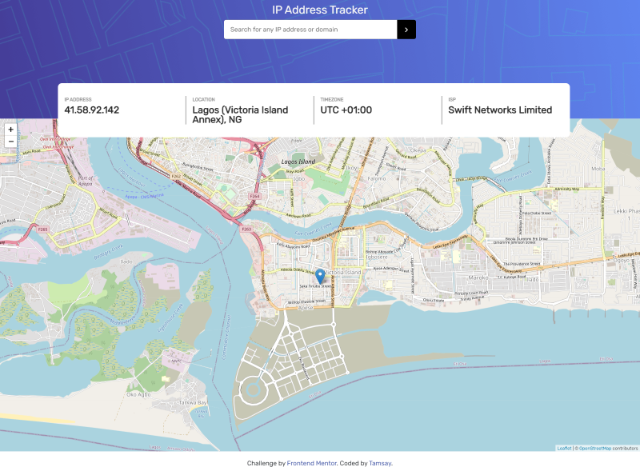
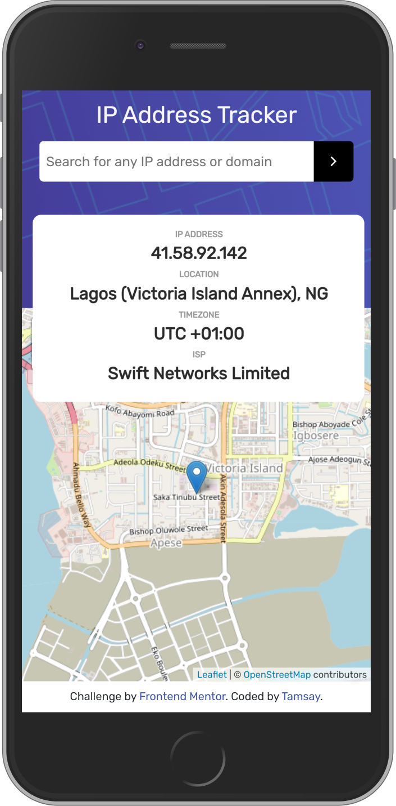

# IP Address Tracker

The project was created using vanilla js, html, css and bootstrap. 

### Welcome! 👋
This App helps to display some key details about IP addresses. Users are able to do the following with the app:

- View the optimal layout for each page depending on their device's screen size
- See their own IP Address on the map on the initial page load
- Search for any IP addresses or domains and see the key information and location

## Screenshots

## Show your support

Give a ⭐️ if you like this project!

## Acknowledgments

Project inspired by [Frontend Mentor](https://www.frontendmentor.io/)

